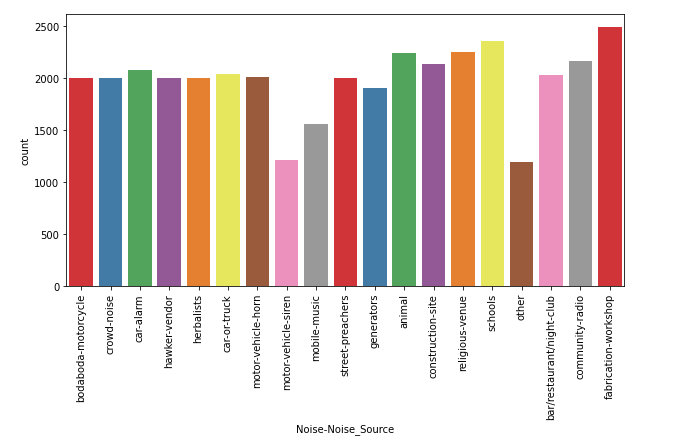
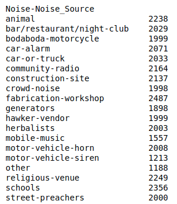

# ODK Noise Data Pipeline
A pipeline for downloading, cleaning and transforming noise data ODK Central

## Overview
This project uses the [ODK Central API](https://odkcentral.docs.apiary.io/#introduction/api-overview) to download our phone-collected ODK noise data from our ODK Central server

# Running the project 
- Clone the repository: `git clone https://github.com/SunbirdAI/odk-noise-data-pipeline.git`
- In your terminal, change directory to the repository folder: `cd odk-noise-data-pipeline`
- Create and run a virtual environment: `python3 -m virtualenv venv`, then `source venv/bin/activate`
- Create a `.env` file in the project root and fill in the environment variables as shown in the provided `env.example` file
- Run the script: `python bulk_odk_download.py`. The script downloads the ODK data into the `data` folder

# Next steps
## Results of the data download
The downloaded data is in a zipped folder (`dataset.zip`) that contains:
- a `media` folder for the audio files
- a `csv` file containing the related metadata (`build_Noise-Capture-Form_1614927724.csv`)

The zipped folder can be unzipped using the  `jar` command as shown in this example: `jar -xvf /Directory/File.zip`

## Data cleaning and transformation
The data cleaning and transformation scripts are contained within the `data` folder

The files are:
- `clean_metadata_file_black.py`: This file contains Python code that cleans the csv metadata file (`build_Noise-Capture-Form_1614927724.csv`) and produces a new cleaned csv file (`noise_metadata.csv`). The cleaning steps are described in a docstring at the top of the Python file
- `move_duplicate_files.sh`: This finds duplicate audio files within the media folder and moves them to a folder named `duplicated-files`
- `sample_balanced_classes.py`: This gets a sample of balanced classes from the noise dataset (100 samples per class)

## Number of audio files per class after cleaning:
- **Countplot for those who prefer graphics** :framed_picture:

- **Raw numbers for those who adore numbers** :pencil:

